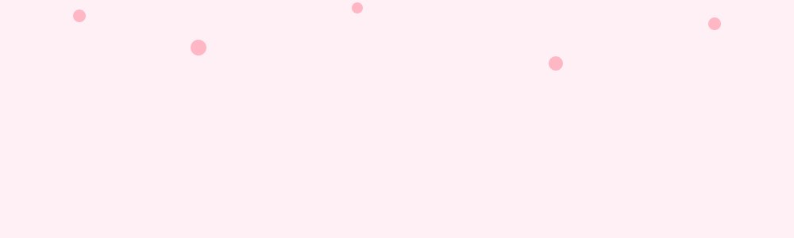

# 🌸 𝒮𝒶𝓀𝓊𝓇𝒶 𝒟𝓇ℯ𝒶𝓂𝒾𝓃ℊ 𝒟ℯ𝓋ℯ𝓁ℴ𝓅ℯ𝓇 🍮

### ✨ 𝑹𝒆𝒂𝒍-𝒕𝒊𝒎𝒆 𝑹𝒆𝒏𝒅𝒆𝒓𝒊𝒏𝒈 · 𝑮𝒓𝒂𝒑𝒉𝒊𝒄𝒔 · 𝑮𝒂𝒎𝒆 𝑻𝒆𝒄𝒉 ✨

🍮 🐰 🌸 ⚔️ 🌸 🐰 🍮

<table align="center" width="100%">
  <tr>
    <td width="55%">
       
      <b>🍮 Nickname:</b> nana   
      <b>🌸 Role:</b> Computer Graphics Developer & Real-time Rendering Learner  
      <b>🔮 Ultimate Title:</b> Super High School Level Chuunibyou  
      <b>🎀 Focus:</b> Rendering Pipeline, Shaders, Engine Technology  
      <b>💫 Dream:</b> <i>"Create beautiful worlds with code"</i>  
    </td>
    <td width="45%" align="center">
      
    </td>
  </tr>
</table>

---

  
  
<strong>🌟 Languages & Core Foundation 🌟</strong>

  
  
  

  
<strong>🎨 Graphics & Rendering API 🎨</strong>

  
  

  
<strong>🛠️ Tools & Engine Technology 🛠️</strong>

  
  
  

---

---

<table align="center" width="100%">
  <tr>
    <th align="center" width="50%">✨ Favorite Characters ✨</th>
    <th align="center" width="50%">🎮 Anime & Games 🎮</th>
  </tr>
  <tr>
    <td>
       
      🍮 <b>Cute & Healing:</b> Pompompurin, Usagi  
      ⚔️ <b>My Fighters:</b> Saber, Saito Hajime  
      🌸 <b>Beautiful Girls:</b> Yae Sakura, Nikki  
      💙 <b>Husbandos:</b> Lu Jinghe, Yagashiro Jou  
    </td>
    <td>
       
      🌌 <b>Favorite Genres:</b> Fantasy, RPG Adventure, Visual Novel  
      🎨 <b>Aesthetic:</b> Beautiful Visual Design & Character Stories  
      ✨ <b>Core Vibe:</b> <i>"Exploring a world that feels alive."</i>  
    </td>
  </tr>
</table>

---

🌸 🍮 🐰 🌸

### "ℳ𝒶𝓎 ℯ𝓋ℯ𝓇𝓎 𝓁𝒾𝓃ℯ ℴ𝒻 𝒸ℴ𝒹ℯ 𝒷𝓁ℴℴ𝓂 𝓁𝒾𝓀ℯ 𝒶 𝓈𝒶𝓀𝓊𝓇𝒶."

